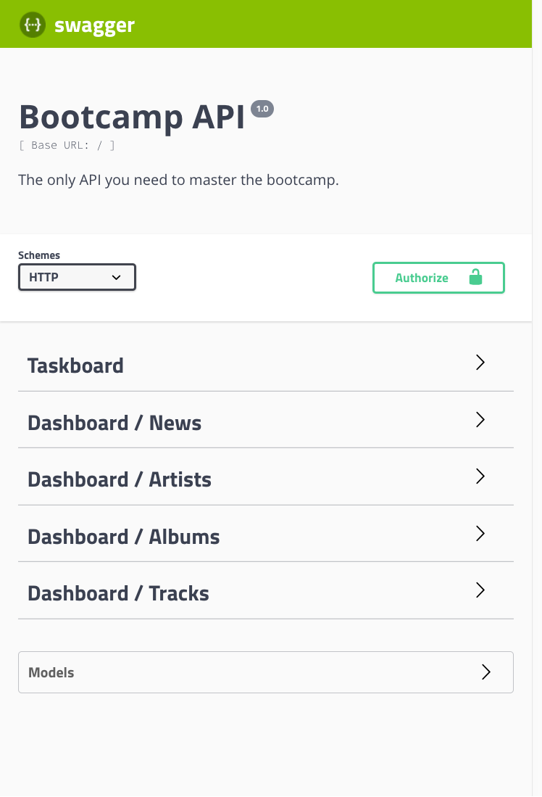

# Bootcamp API

> The one and only API you ever need to master this bootcamp!

Die Bootcamp API stellt drei Endpunkte zur Verfügung, um die Komplexaufgaben zu
lösen.

1.  Taskboard API
2.  Chat API
3.  Dashboard API

## Installation und Start

Bitte lade die Bootcamp API herunter und installiere sie, wie im folgenden
Snippet beschrieben.
Nach der Installation läuft die API lokal und benötigt keinen Zugriff auf andere Netzwerkressourcen.

> **Hinweis** Nachdem `npm start` ausgeführt wurde, startet die API unter https://localhost:3000.

```bash
# Herunterladen
git clone https://github.com/ui-bootcamp/bootcamp-api.git

# In das API Verzeichnis wechseln
cd bootcamp-api

# Abhängigkeiten installieren
npm install

# API starten
npm start
```

## Dokumentation

### HTTP

Die RESTful APIs _Taskboard_ und _Dashboard_ wurden mit
[Swagger](https://swagger.io/) dokumentiert. Nach dem starten der API befindet
sich unter http://localhost:3000/api/ eine interaktive Dokumentation.



### Websocket

Die Chat-API wird durch eine Websocket-Verbindung genutzt.
Das obige Bild zeigt, wie Client und WebSocket miteinander kommunizieren.
Der Client sendet eine Nachricht.
Die Nachricht wird durch den Server verarbeitet.
Nun **kann** der Server in Reaktion eine Nachricht eine Antwort zurücksenden.
Das ist allerdings nicht zwingend erforderlich.
Wenn der Client eine Nachricht an einen WebSocket-Endpunkt sendet spricht mann
von einem `Fire & Forget`, weil der Client nicht direkt auf eine Antwort wartet.
Der Client kann allerdings bestimmte Nachrichten-Typen vom Server abonnieren
und verarbeiten, sobald sie eintreffen.


#### Mit Websocket API verbinden

Nachdem `npm start` ausgeführt wurde kann unter Angabe [ws://localhost:3000](#)
die Socketverbindung hergestellt werden.

> **Hinweis** Wie genau die Socketverbindung in einem Angular-Projekt
> hergestellt wird, ist in in der [Chat-Aufgabe](https://github.com/ui-bootcamp/bootcamp-schedule/tree/master/05-chat)
> beschrieben.

#### Chatnachrichten anfordern und empfangen

Um früher versendete Chatnachrichten zu laden muss einer geöffnete
Socketverbindung in `Event Name` übergeben werden.
Das folgendes Code Snippet skizziert, wie die Anweisung ausgeführt werden kann.

```ts
// ...
socket.emit('[Chat:Client] Load messages from history');
```

Die gesendete Nachricht wird durch den Server verarbeitet.
Anschließend reagiert dieser mit einer eigenen Nachricht, die
der Client vorab abonnieren muss.

```ts
// plain socket
socket.on('[Chat] All past messages have been loaded', callback);

// observable ngx-socket-io
socket
  .fromEvent('[Chat] All past messages have been loaded')
  .pipe(
    // add operators
  (;
```

|             |                                               |
| ----------- | --------------------------------------------- |
| **Anfrage** | `'[Chat:Client] Load messages from history'`  |
| **Antwort** | `'[Chat] All past messages have been loaded'` |

#### Chatnachricht senden

Eine Nachricht wird versendet, in dem neben dem `Event Name` eine `Payload`
übergeben wird.
Die Tabelle unter dem Code Snippet spezifiziert, welche Felder eine Chat Message
haben muss.

```ts
// ...
socket.emit('[Chat:Client] Publish message to the channel', message);
```

| Property  | Typ    |
| --------- | ------ |
| guid      | string |
| text      | string |
| writtenBy | string |
| writtenAt | Date   |

> **Hinweis** Wenn eine dieser Eigenschaften nicht übergeben wird, gibt der
> WebSocket eine Fehlermeldung zurück.

Nachdem die neue Nachricht an den WebSocket-Endpunkt versendet und erfolgreich
verarbeitet wurde, wird eine Nachricht an **alle** Clients versendet, um die
neue Chat-Nachricht dem Leser präsentieren zu können.

|             |                                                  |
| ----------- | ------------------------------------------------ |
| **Anfrage** | `'[Chat:Client] Publish message to the channel'` |
| **Antwort** | `'[Chat] A new message has been published'`      |

Wenn es also mehrere geöffnete Chat-Clients gibt und eine dieser
Clients eine Nachricht publiziert, empfangen alle anderen Clients die neue
Nachricht, da der Server diese per _Broadcast_ verschickt.


#### Chatverlauf löschen

Falls während der Lösung der Komplexaufgabe unübersichtlich viele
Chatnachrichten im Verlauf stehen, können mit folgender Anweisung alle
Nachrichten von Server gelöscht werden.

```ts
// ...
socket.emit('[Chat:Client] Remove messages from history');
```

Wurde die Aufforderung zur Löschung der Chatnachrichten versendet, reagiert
der Server damit, dass eine leere Liste zurücksendet.
Der Abonnent, der die Liste der Chatnachrichten verwaltet wird also automatisch
benachrichtigt, dass es nun keine Nachrichten mehr gibt.

|             |                                                |
| ----------- | ---------------------------------------------- |
| **Anfrage** | `'[Chat:Client] Remove messages from history'` |
| **Antwort** | `'[Chat] All past messages have been loaded'`  |
